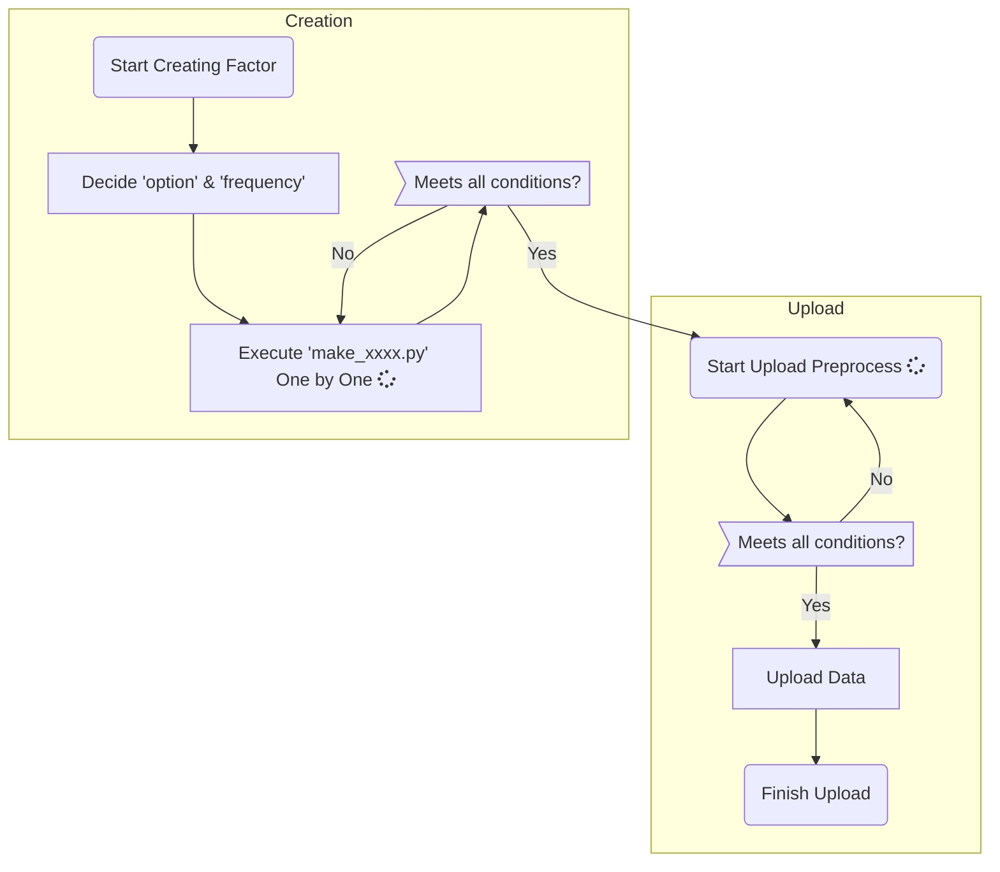

# SSeries Factors Alpha Module ver.1.0

*Anaconda3-5.2.0-Windows-x86_64.exe* | *python 3.6.5* :smile:


## Introduction

> The purpose of creating ***'SSeries Alpha Module'*** is:
>
> - Streamline factor creation.
>   - Given the availability of data, even the most financially complex factors can be created in a matter of hours though combining blocks of methods and classes. (*Inspired by S&P Capital IQ's factor formation methodology*)
> - Implement uniform conditions to meet factor data standard to ensure integrity, and reflect same universe across factors created in this module.
> - Share same functions and utilities to ensure accuracy and stability.
> - Monitor creation or upload errors by making logs of:
>   - Completion percentage of MSCI universe.
>   - `Null` or `Infinity` Values in factor, and `AssertionErrors`.
>   - SQL Errors.


## Improvements & To Do

- [x] Quarterly financial values can be used in **trailing 4Qtr summation**, **trailing 4Qtr average**, and **simple Qtr value as is**.
- [x] **Forward 12Months** for IBES estimates can be used by weight-averaging **FY1** and **FY2** according to acquired date.
- [x] Made tools for creating ***change/growth over last n years/quarters***.
- [x] Full module to extract **Axioma** factor values.
- [ ] Find missing holes in mapping and correct it.
- [ ] Refining log


## Short Summary for Factor Creation Mechanism

Inspired by S&P Capital IQ's factor formation methodology, this module follows the exact same mechanism to create `quarterly`, `yearly`, and other types of frequency data as well.


> ### S&P Clarify Concept Editor (ex. ROA)
> 
>
> - As illustrated above, SSeries Alpha Module combines blocks of value chunks into a single vector of factor values. This process allows to standardize and easily replicate any form of financial derivation.
>
> 
>
> ### S&P `Resample` Methodology
> 
>
> - `Resample` function in SSeries Alpha module has the same role as its counterpart in S&P Clarify concept. Fills sparse values across the calendar year into uniform date-sequence values.
> - This facilitates simple arithmetic operations such as `addition`, `subtraction`, `multiplication`, and `division` while matching **Fiscal Periods** between values (following proper ***accounting principles***).


## Universe

- Mapping utility functions map securities to different vendors.
  - While may need some more tests, current version uses:
    - `batch_utils.utils_mapping_origin` for **worldscope** and **IBES**
    - `batch_utils.utils_mapping` for **axioma** and **starmine**
- **Uniform universe**, trims down mapping securities to universe in `RSCH_DS_DY`'s all distinct *TimeSeriesCode* securities.


## Batch Types

### Creation

- SSeries batch has 2 options for **frequency**:

  - **M**: Monthly (every 26th of each month)
  - **W**: Weekly (every Friday)

- Creation **option** is either:

  - **backfill**: Creates all data-points,
    - for ***Monthly*** since, *'2000-01-26 ~ Today'*
    - for ***Weekly*** since, *'2017-11-17 ~ Today'*
  - **batch**: Creates last 4 most recent dates (either weekly or monthly)

- How to execute a batch file:

  - Every `make_xxxx.py` is an execution python file for creating factor.

  - How to run:

    ```bash
    $ python make_xxxx.py "backfill" "M"
                               ↑      ↑  (arguments)
    or
    $ python make_xxxx.py "backfill" "W"
    or
    $ python make_xxxx.py "batch" "M"
    or
    $ python make_xxxx.py "batch" "W"
    ```

- Created factors will be saved as **pickle** in either `save_batch/` or `save_total/` folder accordingly to option arguments.


### Upload

- Reads **pickle** files in either `save_batch/` or `save_total/` folder, and uploads factor to designated database table in sequence.

- Preprocessing before uploading raw files:
  - Looks up `batch_utils/key_files/FactorBuild_adjSignal.csv` to see if this is a legitimate factor to be uploaded.
  - If factor is in record, will check method to preprocess factor value.
  - Types of preprocess methods:
    - **r**: reciprocal ($ y = \frac{1}{x} $ ex. PE, PB ratios)
    - **m**: minus ($ y = -x $)
    - **l**: log ($ y = log(x) $)
    - **nl**: negative log ($ y = -log(x) $ ex. MarketCap)
    - **c**: copy ($ y = x $)

- Also, winsorizes daily factor values to range between ***zscore -4 ~ 4 from median value***.

- Preprocessed value will be saved in `Value_adj` column.

- Also adds reference information from QAD server's `SecMstrX` table, to make debugging easier when incorrect values are discovered.

  > Currently **'Monthly'** uploaded in `EJ_WRK_FACTORS3` table in `MSSQL_DEV` server.
  >
  > Currently **'Weekly'** uploaded in `EJ_LIVE_FACTORS2` table in `MSSQL_DEV` server.


## Life-Cycle of Batch Module




## Current Factors in ver.1.0 <sub>[Details](./README/Factor_Definition.pdf)</sub>

| Factor Names        |
| ------------------- |
| 5YRel_CFO2EV        |
| 5YRel_CFO2P         |
| 5YRel_EBITDA2P      |
| Accruals            |
| Accruals.S          |
| ARDays              |
| ARM_starmine        |
| CAcqR               |
| CFO2EV              |
| CFROIC              |
| DY_curr             |
| DY_f12m             |
| EBITDAM             |
| EBITDAM_l2yrAvg_chg |
| EGP_f2yr            |
| EPSg_f2yr           |
| EPSg_l2yr           |
| EPSRev3M            |
| EQ_starmine         |
| EV2EBITDA           |
| FCF2EV              |
| FCFROIC             |
| GPM_ws              |
| GPOA                |
| IntC                |
| LTDtCE_ws           |
| LTDtE               |
| MediumTermMomentum  |
| MkCap_curr          |
| NIg_l1yr_ws         |
| NM                  |
| NM_l2yrAvg_chg      |
| NM_ws               |
| OpLev               |
| OPM                 |
| OPM_l2yrAvg_chg     |
| OPM_ws              |
| Payout_curr         |
| Payout_l2yr         |
| PB_curr             |
| PC_curr             |
| PE_curr             |
| PE_f12m             |
| PFCF_curr           |
| PS_curr             |
| REVg_l1yr_ws        |
| ROA_ws              |
| ROE_curr            |
| ROE_l2yr            |
| ROE_ws              |
| ROEavg_f2yr         |
| ROIC                |
| SGP_f2yr            |
| ShortTermMomentum   |
| SustG               |
